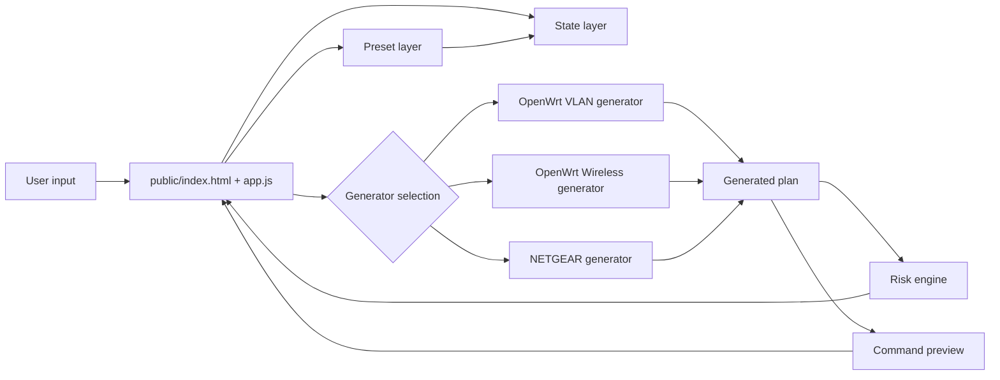

# Architecture

## Purpose

This document is the primary reference for humans and AI agents extending Network Command Helper.

The project deliberately separates:

1. **UI state and interaction**
2. **configuration generation**
3. **risk assessment**
4. **presets**
5. **device/platform-specific syntax**

Do not put large command-generation functions directly in `app.js`.

## Design goals

- Keep `/public/` independently hostable.
- No build step or runtime dependencies.
- Keep generated commands readable and ordered in the same sequence an administrator would apply them.
- Keep platform syntax isolated so OpenWrt and NETGEAR logic do not become interleaved.
- Preserve a preview-before-run workflow.
- Prefer additive changes over destructive changes.
- Make potentially disruptive changes visible through the change-risk system.
- Keep Simple mode useful without hiding command output.
- Allow Advanced and Expert modes to progressively reveal additional fields.

## High-level architecture



## Browser namespace

All JavaScript attaches to one global namespace:

```text
window.NCH
```

Each file owns a child namespace rather than introducing additional globals.

Example:

```text
NCH.utils
NCH.state
NCH.risk
NCH.presets.openwrt
NCH.generators.openwrtVlan
NCH.generators.openwrtWireless
NCH.generators.netgear
NCH.app
```

The project currently uses classic `<script defer>` loading rather than ES modules. This keeps the project modular while preserving direct `file://` usage and zero-build static hosting.

## File responsibilities

### `public/index.html`

Owns markup only:

- shell/header
- operating-level controls
- device/task navigation
- forms
- topology/summary surfaces
- generated command output

It should contain no command-generation logic.

### `public/assets/css/app.css`

Owns presentation and responsive layout.

### `core/config.js`

Owns defaults and shared constants.

Examples:

- default VLAN values
- default wireless values
- default NETGEAR values
- operating-level definitions

### `core/utils.js`

Pure helpers only.

Examples:

- sanitising UCI section names
- IPv4/CIDR validation
- VLAN-range parsing
- prefix-to-netmask conversion
- safe command-value quoting

Do not read or modify the DOM from this file.

### `core/state.js`

Owns browser persistence.

Current implementation uses `localStorage`.

The state layer must never generate commands.

### `core/risk.js`

Owns the advisory change-risk model.

Generators emit risk facts, for example:

```js
{
    level: "medium",
    code: "NETWORK_RELOAD",
    message: "Reloads OpenWrt networking"
}
```

The risk engine reduces those facts into the highest overall risk and a deduplicated list of reasons.

Risk ordering:

```text
low < medium < high
```

### `generators/openwrt-vlan.js`

Owns OpenWrt network-layer generation:

```text
switch VLAN
802.1Q device
bridge
Layer-3 interface
DHCP
firewall zone
CIDR deny/allow
WAN forwarding
DHCP/DNS/ICMP input exceptions
commit/reload/verify
```

Do not add wireless commands here.

### `generators/openwrt-wireless.js`

Owns `wifi-iface` generation.

Supported modes:

#### Standard BSS

```text
device/radio
mode=ap
network
SSID
encryption
key where applicable
isolate
bridge_isolate
hidden
```

#### Enterprise dynamic VLAN BSS

```text
device/radio
mode=ap
SSID
encryption=wpa2
RADIUS server/port/secret
dynamic_vlan = 1 or 2
vlan_tagged_interface
vlan_bridge
vlan_naming
```

When dynamic VLAN is active, the generator intentionally omits/deletes the normal `network` option. This follows the OpenWrt dynamic-VLAN documentation and avoids binding the BSS to one static network while RADIUS is assigning client VLANs.

### `generators/netgear.js`

Owns NETGEAR CLI generation only.

Current tasks:

- trunk/hybrid port
- access port
- VLAN creation
- verification
- save

Native/PVID modification is intentionally optional and is considered high risk.

### `presets/openwrt.js`

Presets are data transformations, not generators.

A preset should populate fields and then let the same generator produce commands.

Current presets:

- Setup VLAN
- Wi-Fi Admins
- Wi-Fi Guests

The Wi-Fi Guests preset enables `isolate` and `bridge_isolate` by default.

## Operating levels

Operating levels control field visibility only. They must not silently change generated security policy merely because the user switches level.

### Simple

Purpose: intent/preset driven.

Shows:

- preset/task
- essential VLAN/subnet values
- essential SSID/security values
- isolation toggle for guest use cases

### Advanced

Shows:

- firewall CIDRs
- DHCP options
- radio/network binding
- encryption details
- verification/apply options

### Expert

Shows:

- switch device and CPU port
- parent interface
- bridge names
- explicit UCI section names
- dynamic VLAN tagged interface / bridge / naming
- native VLAN/PVID switch controls

## Change-risk model

The risk system is intentionally simple and explainable.

### Low

Examples:

- create a new VLAN
- add an isolated SSID
- add tagged VLAN membership without changing PVID
- generate read-only verification commands

### Medium

Examples:

- add broad forwarding
- permit router input services
- enable 802.1X dynamic VLAN assignment
- reload OpenWrt networking/wireless

### High

Examples:

- modify native VLAN/PVID
- make the router zone `INPUT ACCEPT`
- alter a management-facing VLAN
- destructive removal of an existing interface/bridge

When adding a generator, add risk facts in that generator rather than hardcoding platform knowledge in `app.js`.

## Command ordering

Generated commands should follow dependency order.

For an OpenWrt VLAN:

```text
1. switch VLAN
2. 802.1Q device
3. bridge
4. L3 interface
5. DHCP
6. firewall zone
7. specific deny rules
8. broader allow rules
9. zone forwarding
10. router input exceptions
11. commit
12. validate
13. reload
14. verify
```

Specific deny rules must appear before broader allow rules when the generated firewall logic depends on ordered matching.

For wireless:

```text
1. create/update wifi-iface
2. bind static network OR configure dynamic VLAN
3. security
4. isolation
5. commit
6. wifi reload
7. verify
```

## Preset definitions

### Setup VLAN

Current defaults:

```text
VLAN 45
setup
172.18.45.0/24
172.18.45.254
allow 172.16.0.0/16
reject 172.16.0.0/24
WAN allowed
```

### Wi-Fi Admins

Based on the working configuration supplied for the project:

```text
VLAN 10
wifi-admins
172.19.20.0/24
172.19.20.254
firewall INPUT ACCEPT
WAN allowed
LAN forwarding allowed
```

The generator does not automatically infer whether router-wide INPUT ACCEPT is desirable in another environment. The preset visibly marks this as higher risk.

### Wi-Fi Guests

Based on the supplied guest configuration:

```text
VLAN 12
wifi-guests
172.19.22.0/24
172.19.22.254
INPUT REJECT
WAN allowed
DHCP/DNS allowed to OpenWrt
```

Wireless defaults additionally enable:

```text
isolate=1
bridge_isolate=1
```

## Dynamic VLAN considerations

The supplied environment includes an Enterprise BSS pattern using:

```text
dynamic_vlan
vlan_tagged_interface
vlan_bridge
vlan_naming
```

Current OpenWrt documentation describes `dynamic_vlan` as tri-state and shows the static `network` option being removed for dynamic VLAN operation.

The UI therefore treats dynamic VLAN as a distinct wireless mode rather than a checkbox attached to a normal statically-bound SSID.

## Regression tests

Before and after changing a generator, run:

```bash
node tests/smoke.js
```

The smoke suite protects the current security-sensitive behaviours: management deny ordering, Wi-Fi Admins forwarding/input policy, guest DHCP/DNS and isolation, RADIUS dynamic VLAN behaviour, and NETGEAR native-VLAN preservation.

## Extending the project

When adding a new module:

1. Add a generator file under `public/assets/js/generators/`.
2. Attach the generator to `NCH.generators`.
3. Generator input should be a plain object.
4. Generator output should follow:

```js
{
    commands: ["..."],
    summary: ["..."],
    risks: [
        {
            level: "low|medium|high",
            code: "STABLE_IDENTIFIER",
            message: "Human readable reason"
        }
    ],
    errors: []
}
```

5. Add only orchestration/UI wiring to `app.js`.
6. Add fields with `data-level` when visibility is level-specific.
7. Add/update README roadmap status.
8. Update this architecture document when responsibilities or schemas change.

## Planned architecture evolution

The next major architectural feature should be a **Configuration Plan** layer.

Instead of rendering one generator result directly:

```text
form -> generator -> commands
```

move toward:

```text
forms/presets
   -> plan items
   -> dependency ordering
   -> cross-device risk analysis
   -> device generators
   -> combined command bundles
```

That enables one user intent such as "Create VLAN 120" to generate coordinated OpenWrt, NETGEAR and eventually Proxmox configuration.
