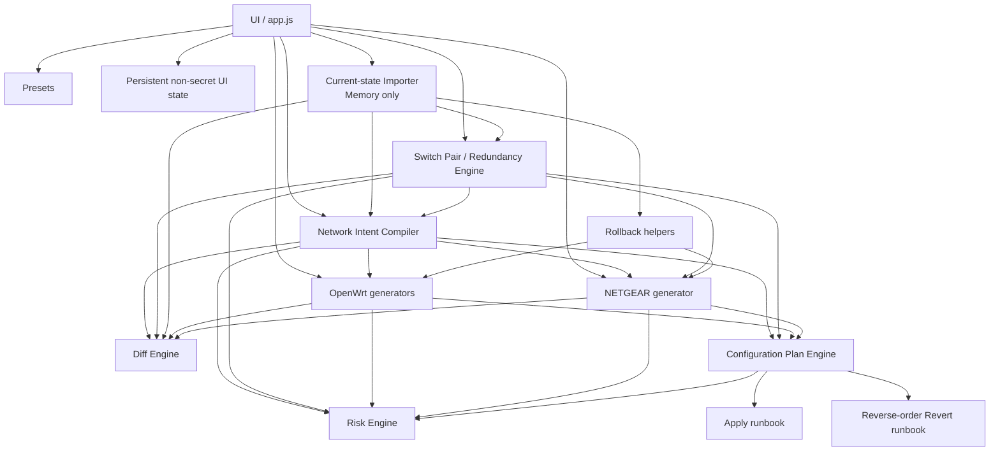

# Architecture

## Purpose

This is the primary architecture reference for humans and AI agents extending Network Command Helper.

The application is a static **configuration compiler/planner**, not a device-management controller. It generates auditable commands; it does not connect to or mutate devices itself.

## Core design principles

1. `/public/` is independently deployable.
2. Device syntax lives in generator modules, never in `app.js`.
3. Presets contain data, not command-generation logic.
4. Current-state imports are memory-only.
5. Secrets are never persisted by default.
6. Generated Apply output must have an explicit rollback story.
7. Never claim an exact Revert without proof of prior state.
8. Partial imports must not be interpreted as proof of absence.
9. Configuration Plans apply in dependency order and Revert in reverse dependency order.
10. Risk facts originate in the generator that understands the device operation.

## High-level architecture



## Public module ownership

```text
public/assets/js/
├── core/
│   ├── config.js      global defaults/version/secret field names
│   ├── utils.js       pure validation/parsing helpers
│   ├── import.js      current device-state parsers
│   ├── rollback.js    prior-state restoration helpers
│   ├── diff.js        current-vs-desired resource comparison
│   ├── plan.js        dependency ordering and multi-step runbooks
│   ├── redundancy.js  switch-pair normalisation, drift policy, remediation and mirrored targets
│   ├── state.js       non-secret localStorage persistence
│   └── risk.js        risk aggregation/presentation model
├── generators/
│   ├── openwrt-vlan.js
│   ├── openwrt-firewall.js
│   ├── openwrt-dhcp-dns.js
│   ├── openwrt-routing.js
│   ├── openwrt-nat.js
│   ├── openwrt-wireless.js
│   └── netgear.js
├── presets/openwrt.js
└── app.js             UI orchestration only
```

## Generator contract

A mutating generator returns:

```js
{
  commands: [],
  rollbackCommands: [],
  rollbackExact: false,
  rollbackNote: "...",
  summary: [],
  risks: [],
  errors: [],
  resources: [],
  meta: {},
  plan: {
    title: "...",
    platform: "openwrt|netgear",
    deviceName: "optional concrete target",
    task: "...",
    order: 50,
    mutating: true
  }
}
```

Read-only generators use the same shape but set `plan.mutating=false` and may return a no-op explanatory Revert.

### `resources`

`resources` describe desired state independently of rendered command text.

Supported resource kinds currently include:

```text
uci-section
uci-list
netgear-vlan
netgear-interface
netgear-lag
```

They are consumed by `core/diff.js`.

Do not parse generated commands to infer desired state when the generator can declare it directly.


## Switch-pair / redundancy architecture

`core/redundancy.js` models two independent NETGEAR switches as a policy pair. It does **not** model stacking, MLAG or one logical chassis.

Inputs:

```text
pair profile
+ sw01 imported running-config
+ sw02 imported running-config
+ mirror policy
+ per-port policy
```

Output:

```text
normalised peer state
        ↓
policy comparison
        ↓
DRIFT / WARNING / MATCH / IGNORED / UNKNOWN
        ↓
optional authority-based remediation
        ↓
Apply + state-aware Revert
```

### Pair identity

Management addresses are expected to be unique. Pair profile identity validates each imported management IP/system name independently, while peer-to-peer comparison ignores management-IP inequality by design.

### Port policy

Each physical port has one mode:

- `mirror`: configured fields participate in pair drift and remediation;
- `exception`: the entire port is excluded from pair drift/remediation;
- `redundancy`: L2/admin equivalence is expected, descriptions may differ, and LAG membership is flagged as incompatible with the intended cross-switch active/backup readiness model.

This distinction prevents legitimate `sw02` standalone workloads from being "corrected" merely because `sw01` uses the same port number differently.

### Mirrored desired changes

The NETGEAR workspace can explicitly target the switch pair. `generateMirroredNetgear()` runs the same desired generator independently against each peer current state, then wraps both outputs into a device-labelled plan. Each peer therefore gets its own rollback assessment.

### Remediation authority

Pair drift remediation is directional: `sw01 -> sw02` or `sw02 -> sw01`. Only mirror-enabled fields and non-exception ports are changed. Extra VLAN removal remains disabled unless the operator explicitly enables destructive reconciliation and complete target state proves absence/removal semantics.

## Apply / Revert patterns

### Pattern A: exact additive section

Example: a named static route or DNAT redirect.

```text
pre-flight: named section must not exist
Apply:      create named section
Revert:     delete named section
```

This does not require imported state.

### Pattern B: exact additive list entry

Example: dnsmasq forwarding value.

```text
pre-flight: exact value must not already be present
Apply:      add_list exact value
Revert:     del_list exact value
```

### Pattern C: modification of existing state

Example: `firewall.wan.masq`, NETGEAR PVID, port speed or wireless BSS replacement.

```text
Import current state
        ↓
Apply desired value
        ↓
Revert restores imported value
```

No imported value means no claim of exact rollback.

### Pattern D: irreversible operation

Example: clearing switch interface counters.

The configuration can still be restored, but historical counters cannot. `rollbackExact` must be false.

## Import architecture

### OpenWrt

Input is output from `uci show`.

The importer preserves:

- package;
- section name;
- section type;
- options;
- repeated options as lists.

Coverage is tracked at package level.

Therefore:

```text
network package imported    → absence of network.foo can be meaningful
network only imported       → absence of firewall.foo is UNKNOWN
```

`rollback.restoreManyUci()` refuses to produce an exact multi-package restoration if any required package was not imported.

### NETGEAR

The parser recognises the supported subset of `show running-config`:

- VLAN definitions/names;
- interfaces/interface ranges;
- descriptions;
- PVID;
- tagged/untagged membership;
- speed;
- flow control;
- shutdown;
- LAG membership/mode;
- LAG type;
- management/global IPv4 settings used for context.

A complete running config is identified using the standard `! Model:` header shown by NETGEAR's text running-config output.

This distinction matters because a partial interface capture cannot prove a missing VLAN is globally absent.

## Diff engine

The diff engine compares imported current state against generator-declared `resources`.

Statuses:

```text
ADD      desired object/value is proven absent
CHANGE   object exists but desired value differs
MATCH    current value already equals desired value
UNKNOWN  imported coverage is insufficient
```

`UNKNOWN` is intentionally preferred over an unsafe assumption.

The UI currently displays the current task diff. Plan-wide cross-device diff can be added later without changing the resource model.


## Network Intent compiler contract

`core/intent.js` is an orchestration/compiler layer, not a vendor generator.

It may:

- validate one desired network definition;
- select device targets;
- translate the intent into inputs for existing OpenWrt/NETGEAR generators;
- create device-labelled plan items;
- dependency-order the resulting plan;
- aggregate per-device diff/risk/Revert state.

It must **not** duplicate OpenWrt UCI or NETGEAR CLI syntax. Vendor syntax remains owned by the relevant generator.

The current VLAN/network intent dependency order is:

```text
sw01 trunk/VLAN preparation   order 10
sw02 trunk/VLAN preparation   order 11
OpenWrt routed VLAN           order 20
```

Revert is the exact reverse order. This ensures routed gateway/firewall/DHCP state is removed before switch VLAN transport is torn down.

Current-state ownership is intentionally per device:

```text
OpenWrt  <- generic memory-only OpenWrt UCI import
sw01     <- switch-pair sw01 running-config import
sw02     <- switch-pair sw02 running-config import
```

A missing import is UNKNOWN. It must never be converted into proof that the desired VLAN/interface did not previously exist.

## Configuration Plan engine

Each generator result can be frozen into an immutable plan item via `NCH.plan.createItem()`.

Plan items contain their already-generated Apply/Revert commands plus risk/errors/resources.

`NCH.plan.compile()`:

1. sorts items by `plan.order`;
2. emits an Apply runbook in forward order;
3. emits Revert in reverse order;
4. aggregates errors/resources/risks;
5. evaluates whole-plan rollback completeness;
6. adds `ROLLBACK_GAP` if any mutating step lacks exact Revert;
7. adds `MULTI_DEVICE_PLAN` when the plan spans multiple platforms.

### Current dependency bands

```text
10  switch VLAN definitions
20  OpenWrt VLAN/network
30  NETGEAR port/LAG membership
40  routing
50  firewall/NAT
60  DHCP/DNS
70  wireless
90  diagnostics
```

These values express broad dependency order, not device transaction semantics.

## Risk architecture

Generators emit risk facts:

```js
{
  level: "low|medium|high",
  code: "STABLE_MACHINE_CODE",
  message: "Human readable explanation"
}
```

The risk engine de-duplicates by code and takes the highest severity.

Examples:

- `NATIVE_VLAN_CHANGE`
- `PORT_SHUTDOWN`
- `LAG_MEMBERSHIP`
- `STATIC_ROUTE`
- `PORT_FORWARD`
- `ROLLBACK_GAP`
- `MULTI_DEVICE_PLAN`

Risk is advisory and does not replace pre/post validation.

## Secret/state handling

`core/config.js` defines secret field IDs.

`core/state.js` recursively blanks those keys before localStorage persistence.

Current imported device configuration and configuration-plan items are intentionally memory-only and reset on reload.

Do not introduce persistence for:

- Wi-Fi PSKs;
- RADIUS shared secrets;
- WireGuard private keys when implemented;
- imported device configs;

without an explicit security design change.

## NETGEAR command-source rule

Only generate NETGEAR commands supported by the reference/manual for the target model family.

The current GS108Tv3 implementation uses documented commands for:

- `interface` / `interface range`;
- `description`;
- `speed`;
- `flowcontrol`;
- `shutdown` / `no shutdown`;
- VLAN/PVID/membership;
- `lag ... mode static|active|passive` / `no lag`;
- read-only show/diagnostic commands.

Do not infer Cisco-like syntax merely because it looks familiar.

## OpenWrt platform boundary

The current VLAN implementation models the existing `swconfig` topology used by the target router.

Future DSA support must be introduced as a separate platform capability/adaptor rather than silently replacing current generator semantics.

## UI boundary

`app.js` may:

- collect fields;
- choose a generator;
- switch operating levels/tasks;
- render risk/diff/visual state;
- add/remove plan items;
- copy output.

`app.js` must not own vendor command syntax.

## Extending the application

For every new mutating feature:

1. define desired-state resource(s);
2. define Apply syntax;
3. define exact Revert requirements;
4. define risk facts;
5. define plan order;
6. add unit tests;
7. add a smoke-path if operationally significant;
8. update README/architecture/testing docs.

If exact rollback cannot be proven, return a useful partial/manual Revert explanation and set `rollbackExact=false`.

## Experimental firmware-emulation boundary

Firmware emulation is deliberately outside the browser/generator execution path. It is a future CI validation layer only.

```text
Normal PR / Pages CI                         Experimental firmware CI
--------------------                        ------------------------
unit + smoke tests                           manual workflow_dispatch
        |                                             |
        v                                             v
static site / Pages                       enable variable + confirmation
                                                      |
                                                      v
                                            dedicated self-hosted runner
                                                      |
                                                      v
                                         HTTPS firmware + SHA-256 verify
                                                      |
                                                      v
                                               FirmAE + Docker/QEMU
                                                      |
                                                      v
                                              emulation check only
```

The firmware workflow is not a dependency of normal CI and cannot trigger automatically. Its trust boundary is intentionally separate because it may require privileged Docker/network emulation and untrusted vendor firmware parsing.

### Firmware artefact rule

Firmware is external test input. It must never be committed to this repository. The CI receives an operator-controlled HTTPS URL and expected SHA-256 digest.

### Fidelity rule

A successful FirmAE run may prove userspace/management compatibility, but it must not be interpreted as authoritative evidence for Realtek RTL8380 switching-ASIC behaviour. Physical hardware-in-the-loop is the future authoritative test layer for forwarding, port, STP and LACP behaviour.
